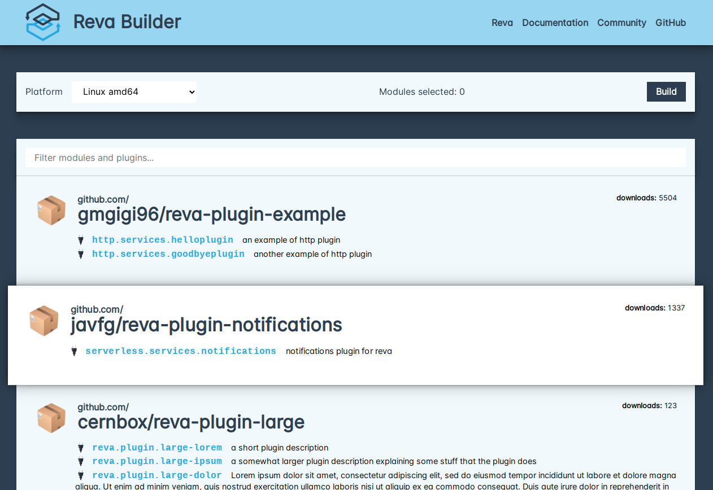

# Gaia frontend


This is the frontend for [Gaia](https://github.com/cs3org/gaia), the custom reva
binary builder.

It provides a lightweight application where the user can choose customizations
and request the creation of a tailored Reva binary. It is heavily inspired in
(or totally plagiarizes) the [Caddy download page](https://caddyserver.com/download).



This frontend will eventually be integrated into gaia, the means are still to be
decided.


## Usage

The application uses [esbuild](https://esbuild.github.io/) to provide building
and development facilities.

### Building

To build a production-ready bundle, just run:

```bash
npm i && npm run build
```

### Development

```bash
npm i && npm run serve
```

This will spin up a dev http server on `http://localhost:8000`. It can be
further configured to different host/port or to add TLS. See
[run.mjs](https://github.com/cs3org/gaia-frontend/tree/master/run.mjs)
for details.
